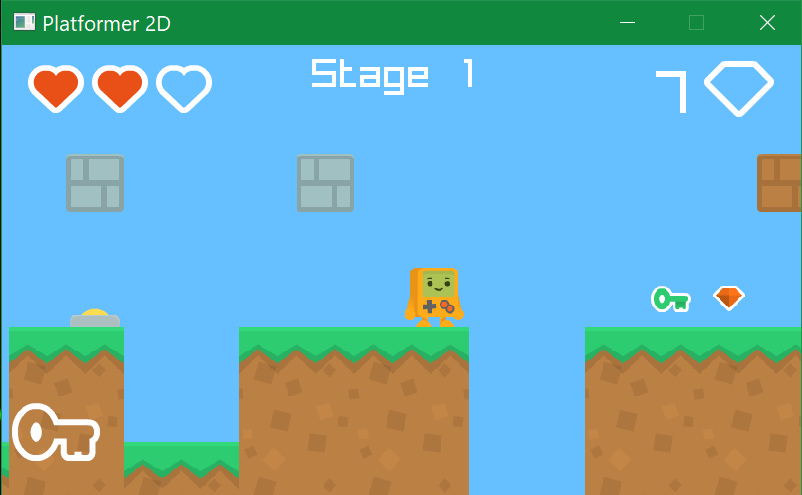

## Gameboy Adventure

### :pen: Description

Basic 2D platformer game like *Super Mario*. Player will have to avoid obastacles, and collect the key to unlock the door to next level. All levels are procedurally generated, and currently there is no difference in difficulty. If player passes a checkpoint in the level, he will respawn at the checkpoint.

### :gear: Tools

- [Raylib](https://www.raylib.com)

### :medal: Features

 - 2D platformer physics
 - procedural generation
 - smooth camera effect
 - checkpoint location

### :gamepad: Controls

Keyboard:
 - KEY_LEFT or KEY_A (to move left)
 - KEY_RIGHT or KEY_D (to move right)
 - KEY_UP or KEY_SPACE (to jump)
 - KEY_ENTER (to unlock door or to enter)

### :camera: Screenshots

### :diamond: Resources

- [Kenny Platformer Assets](https://www.kenney.nl/assets/simplified-platformer-pack)

#### :dart: Todo
- [ ] Particle system & emitter
- [ ] Level difficulty
- [ ] SFX
- [ ] Enemy